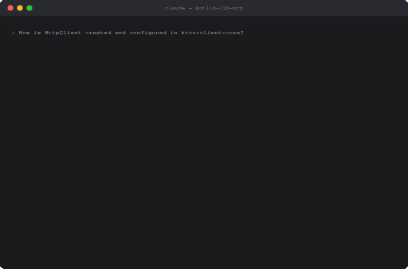
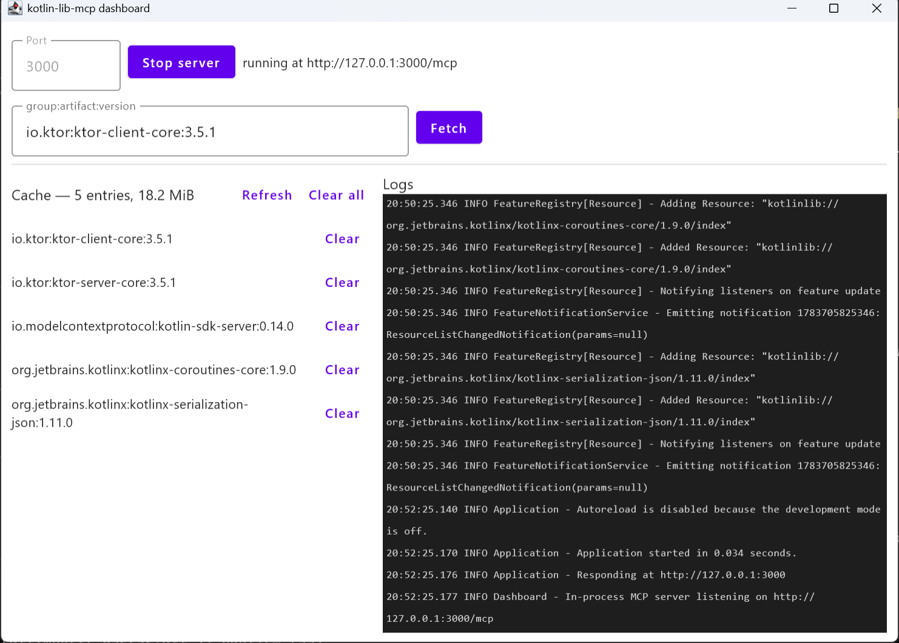

# kotlin-lib-mcp

[](https://github.com/aoreshkov/kotlin-lib-mcp/actions/workflows/ci.yml)
[](https://github.com/aoreshkov/kotlin-lib-mcp/actions/workflows/codeql.yml)
[](https://github.com/aoreshkov/kotlin-lib-mcp/releases/latest)
[](LICENSE)
[](https://kotlinlang.org)

Give your AI agent the **real sources** of any Maven-published Kotlin/Java library.

An [MCP](https://modelcontextprotocol.io) server that, on request, downloads the sources of a
library (e.g. `io.ktor:ktor-client-core:3.5.1`), parses them with the Kotlin **Analysis API**
(standalone K2/FIR mode), and exposes structured information — public API surface, KDoc,
dependencies/metadata, raw source + search — to MCP clients such as Claude Code and Claude
Desktop. An optional Compose Desktop dashboard runs the same server in-process.

<!-- mcp-name: io.github.aoreshkov/kotlin-lib-mcp -->



<details><summary>Compose Desktop dashboard</summary>



</details>

## Why this and not a docs-lookup server?

Most documentation MCP servers scrape rendered doc sites or feed the model pre-digested
summaries. This one works from the **published sources jar** — the ground truth:

- **Resolved signatures, not regex guesses.** Declarations are analyzed with the same
  Analysis API that powers the Kotlin IDE, so `get_api_signature` returns real, type-resolved
  signatures (with graceful best-effort fallback when transitive dependencies are missing).
- **KMP-aware.** Kotlin Multiplatform libraries publish per-target sources jars; these are
  resolved properly via `.module` Gradle metadata, and every symbol is tagged with its targets.
- **KDoc as data.** Summaries, descriptions and tags are extracted per declaration — not
  whole HTML pages.
- **Exact version you asked for, offline after the first fetch.** Everything is cached on
  disk keyed by `group/artifact/version`; no re-downloads, no drift between the docs and the
  version you actually depend on.
- **Raw source when you need it.** `get_source` and bounded `search_source` let the agent
  read the actual implementation, not just the API.

## Quick start (no build required)

**Option 1 — release zip.** Download the latest
[release](https://github.com/aoreshkov/kotlin-lib-mcp/releases/latest), unzip (needs a
Java 21+ runtime), then:

```sh
claude mcp add kotlin-lib -- /path/to/kotlin-lib-mcp-server-<version>/bin/server --transport stdio
```

**Option 2 — Docker.**

```sh
claude mcp add kotlin-lib -- docker run -i --rm -v kotlin-lib-mcp-cache:/home/mcp/.cache ghcr.io/aoreshkov/kotlin-lib-mcp
```

**Option 3 — MCP Registry.** The server is published to the
[official MCP registry](https://registry.modelcontextprotocol.io) as
`io.github.aoreshkov/kotlin-lib-mcp`; registry-aware clients can install it from there.

Or in `.mcp.json` / Claude Desktop config:

```json
{
  "mcpServers": {
    "kotlin-lib": {
      "command": "C:/path/to/kotlin-lib-mcp-server-<version>/bin/server.bat",
      "args": ["--transport", "stdio"]
    }
  }
}
```

For remote use, run the http transport (`--transport http --port 3000`) and point the client
at `http://127.0.0.1:3000/mcp` — DNS-rebinding protection admits localhost hosts by default;
`--allowed-host`/`--allowed-origin` extend the allowlist for non-localhost deployments.

CLI flags: `--transport stdio|http`, `--port <int>` (default 3000), `--allowed-host <host>` /
`--allowed-origin <url>` (repeatable; extend the http transport's localhost-only defaults),
`--cache-dir <path>`, `--repo <url>` (repeatable; Maven Central is the default), `--help`.

## Tools

All tools take a Maven `coordinate` (`group:artifact:version`). Call **`fetch_library`** first —
it downloads, extracts and analyzes the sources once; every other tool answers from the cached
index. `fetch_library`, `list_versions` and `get_latest_version` also accept `group:artifact`, and
`fetch_library` accepts `group:artifact:latest` to resolve the latest stable release.

| Tool | Purpose |
|---|---|
| `fetch_library` | Download + analyze + cache; returns a summary. Idempotent. Version may be omitted or `latest` |
| `list_packages` | Packages with declaration counts and KMP targets |
| `list_declarations` | Declarations with signatures; filter by `package` and `visibility` |
| `get_api_signature` | Resolved signature of one declaration by FQ name |
| `get_kdoc` | KDoc (summary, description, tags) of one declaration |
| `get_source` | Raw source of a file (`path`) or one declaration (`fqName`) |
| `search_source` | Substring/regex search; bounded, returns `file:line` snippets |
| `get_dependencies` | Dependency tree from `.pom`/`.module`; bounded `depth` |
| `list_versions` | Published versions from `maven-metadata.xml`, newest-first |
| `get_latest_version` | Latest stable release (and newest overall) from `maven-metadata.xml` |

Every tool ships the metadata the MCP spec encourages clients to use: a display `title`,
**behavior annotations** (`readOnlyHint: true` everywhere except `fetch_library`, which is
additive-only — `destructiveHint: false`, `idempotentHint: true`; tools that reach Maven
repositories set `openWorldHint: true`, cache-only tools `false`), and a typed **`outputSchema`**
derived from the response DTO's serializer. Results carry both pretty-printed JSON text and the
matching `structuredContent` object, so structured-output clients and plain-text clients see the
same payload.

`fetch_library` also reports **progress notifications** (download → analyze → cache) when the
client sends a `progressToken`, and the server advertises the **logging capability** — its logs
mirror to clients as `notifications/message` (respecting `logging/setLevel`), which matters on
stdio where stderr is often dropped.

**Resources:** each cached library is readable at
`kotlinlib://{group}/{artifact}/{version}/index` (the parsed index as JSON); the list updates as
libraries are fetched, and the same URI shape is published as a **resource template**, so any
cached coordinate is directly addressable. **Prompt:** `explain_public_api(coordinate, package?)`
renders an explanation request grounded in the cached signatures and KDoc.

## Building from source

```sh
./gradlew build                                    # build everything
./gradlew test                                     # unit tests
./gradlew :server:run --args="--transport stdio"   # local MCP over stdio (default)
./gradlew :server:run --args="--transport http --port 3000"   # Streamable HTTP at /mcp
./gradlew :dashboard:run                           # Compose Desktop UI
./gradlew :server:installDist                      # standalone launcher in server/build/install/server/bin
```

Requires JDK 21 (resolved automatically via Gradle toolchains).

| Module | What it is |
|---|---|
| `core/` | KMP library: domain model + ports (`commonMain`); Maven fetcher, zip extractor, Analysis API analyzer, on-disk cache (`jvmMain`) |
| `server/` | JVM app: MCP tools/resources/prompts + stdio and Streamable HTTP transports |
| `dashboard/` | Compose Desktop control panel embedding the server (optional) |

## Cache

Downloads and the parsed index live under the OS cache dir + `kotlin-lib-mcp`
(`%LOCALAPPDATA%\kotlin-lib-mcp` on Windows, `~/Library/Caches/kotlin-lib-mcp` on macOS,
`$XDG_CACHE_HOME/kotlin-lib-mcp` elsewhere), keyed by `group/artifact/version` — browsable and
safe to delete. `--cache-dir` overrides it.

## Notes

- **stdio rule:** stdout carries only MCP protocol frames; all logging goes to stderr
  (Kermit → SLF4J → Logback, `logback.xml`).
- Kotlin and the Analysis API artifacts are version-locked in `gradle/libs.versions.toml` —
  bump them together. Symbols whose types can't be resolved (missing transitive deps) degrade
  to `bestEffort: true` PSI signatures instead of failing.

## Contributing

Contributions welcome — see [CONTRIBUTING.md](CONTRIBUTING.md). Release history lives in
[CHANGELOG.md](CHANGELOG.md); security reports go through
[private vulnerability reporting](SECURITY.md).

## License

[Apache-2.0](LICENSE)
