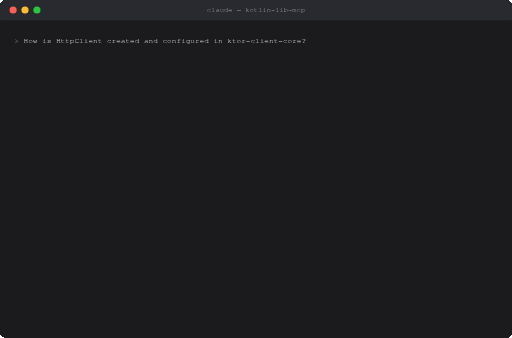
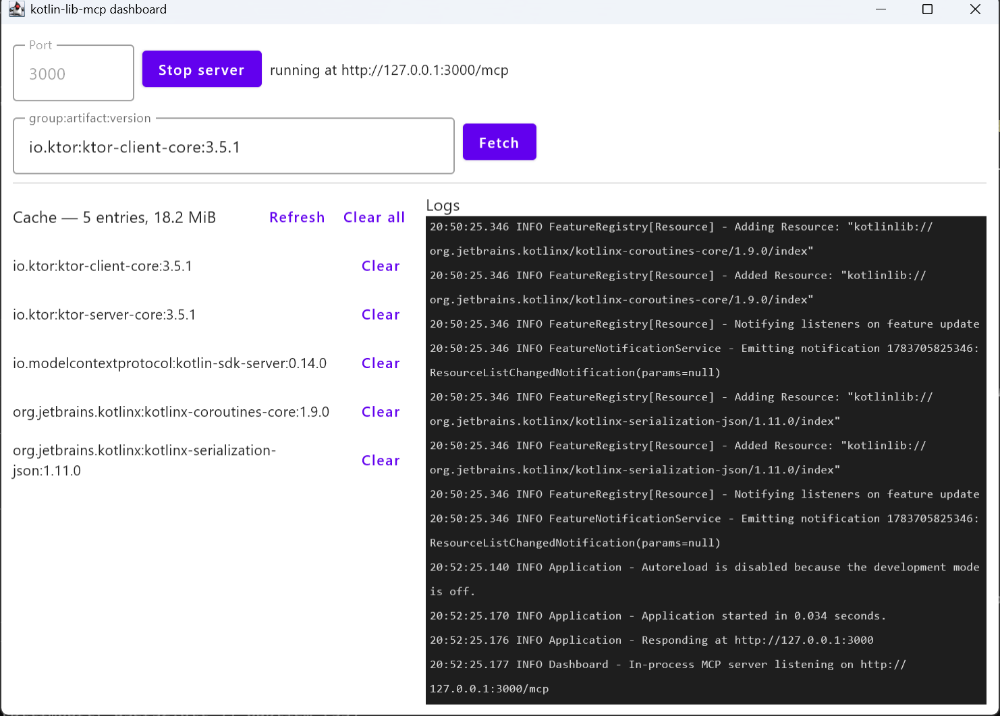

# kotlin-lib-mcp

[](https://github.com/aoreshkov/kotlin-lib-mcp/actions/workflows/ci.yml)
[](https://github.com/aoreshkov/kotlin-lib-mcp/actions/workflows/codeql.yml)
[](https://github.com/aoreshkov/kotlin-lib-mcp/releases/latest)
[](LICENSE)
[](https://kotlinlang.org)

Give your AI agent the **real sources** of any Maven-published Kotlin/Java library.

An [MCP](https://modelcontextprotocol.io) server that, on request, downloads the sources of a
library (e.g. `io.ktor:ktor-client-core:3.5.1`), parses them with the Kotlin **Analysis API**
(standalone K2/FIR mode), and exposes structured information — public API surface, KDoc,
dependencies/metadata, raw source + search — to MCP clients such as Claude Code and Claude
Desktop. An optional Compose Desktop dashboard runs the same server in-process.

[](https://insiders.vscode.dev/redirect?url=vscode%3Amcp%2Finstall%3F%257B%2522name%2522%253A%2522kotlin-lib%2522%252C%2522command%2522%253A%2522docker%2522%252C%2522args%2522%253A%255B%2522run%2522%252C%2522-i%2522%252C%2522--rm%2522%252C%2522-v%2522%252C%2522kotlin-lib-mcp-cache%253A%252Fhome%252Fmcp%252F.cache%2522%252C%2522ghcr.io%252Faoreshkov%252Fkotlin-lib-mcp%2522%255D%257D)
[](https://insiders.vscode.dev/redirect?url=vscode-insiders%3Amcp%2Finstall%3F%257B%2522name%2522%253A%2522kotlin-lib%2522%252C%2522command%2522%253A%2522docker%2522%252C%2522args%2522%253A%255B%2522run%2522%252C%2522-i%2522%252C%2522--rm%2522%252C%2522-v%2522%252C%2522kotlin-lib-mcp-cache%253A%252Fhome%252Fmcp%252F.cache%2522%252C%2522ghcr.io%252Faoreshkov%252Fkotlin-lib-mcp%2522%255D%257D)

Those install the Docker image. For Claude Code, or to run the release zip without Docker, see
[Quick start](#quick-start-no-build-required).

<!-- mcp-name: io.github.aoreshkov/kotlin-lib-mcp -->



<details><summary>Compose Desktop dashboard</summary>



</details>

## Why this and not a docs-lookup server?

Most documentation MCP servers scrape rendered doc sites or feed the model pre-digested
summaries. This one works from the **published sources jar** — the ground truth:

- **Resolved signatures, not regex guesses.** Declarations are analyzed with the same
  Analysis API that powers the Kotlin IDE, so `get_api_signature` returns real, type-resolved
  signatures (with graceful best-effort fallback when transitive dependencies are missing).
- **KMP-aware.** Kotlin Multiplatform libraries publish per-target sources jars; these are
  resolved properly via `.module` Gradle metadata, and every symbol is tagged with its targets.
- **KDoc as data.** Summaries, descriptions and tags are extracted per declaration — not
  whole HTML pages.
- **Exact version you asked for, offline after the first fetch.** Everything is cached on
  disk keyed by `group/artifact/version`; no re-downloads, no drift between the docs and the
  version you actually depend on.
- **Raw source when you need it.** `get_source` and bounded `search_source` let the agent
  read the actual implementation, not just the API.

## Quick start (no build required)

**Option 1 — release zip.** Download the latest
[release](https://github.com/aoreshkov/kotlin-lib-mcp/releases/latest), unzip (needs a
Java 21+ runtime), then:

```sh
claude mcp add kotlin-lib -- /path/to/kotlin-lib-mcp-server-<version>/bin/server --transport stdio
```

**Option 2 — Docker.**

```sh
claude mcp add kotlin-lib -- docker run -i --rm -v kotlin-lib-mcp-cache:/home/mcp/.cache ghcr.io/aoreshkov/kotlin-lib-mcp
```

**Option 3 — MCP Registry.** The server is published to the
[official MCP registry](https://registry.modelcontextprotocol.io) as
`io.github.aoreshkov/kotlin-lib-mcp`; registry-aware clients can install it from there.

Or in `.mcp.json` / Claude Desktop config:

```json
{
  "mcpServers": {
    "kotlin-lib": {
      "command": "C:/path/to/kotlin-lib-mcp-server-<version>/bin/server.bat",
      "args": ["--transport", "stdio"]
    }
  }
}
```

For remote use, run the http transport (`--transport http --port 3000`) and point the client
at `http://127.0.0.1:3000/mcp` — DNS-rebinding protection admits localhost hosts by default;
`--allowed-host`/`--allowed-origin` extend the allowlist for non-localhost deployments.

CLI flags: `--transport stdio|http`, `--port <int>` (default 3000), `--allowed-host <host>` /
`--allowed-origin <url>` (repeatable; extend the http transport's localhost-only defaults),
`--cache-dir <path>`, `--repo <url>` (repeatable; Maven Central is the default),
`--forward-logs-to-client` (opt into mirroring logs to the client; off by default, stderr-only),
`--otel` (opt into OTLP/HTTP trace export; off by default — see [Telemetry](#telemetry)), `--help`.

## Tools

All tools take a Maven `coordinate` (`group:artifact:version`). Call **`fetch_library`** first —
it downloads, extracts and analyzes the sources once; every other tool answers from the cached
index. `fetch_library`, `list_versions` and `get_latest_version` also accept `group:artifact`, and
`fetch_library` accepts `group:artifact:latest` to resolve the latest stable release.

| Tool | Purpose |
|---|---|
| `fetch_library` | Download + analyze + cache; returns a summary. Idempotent. Version may be omitted or `latest` |
| `list_packages` | Packages with declaration counts and KMP targets |
| `list_declarations` | Declarations with signatures; filter by `package` and `visibility` |
| `get_api_signature` | Resolved signature of one declaration by FQ name |
| `get_kdoc` | KDoc (summary, description, tags) of one declaration |
| `get_source` | Raw source of a file (`path`) or one declaration (`fqName`) |
| `search_source` | Substring/regex search; bounded, returns `file:line` snippets |
| `get_dependencies` | Dependency tree from `.pom`/`.module`; bounded `depth` |
| `list_versions` | Published versions from `maven-metadata.xml`, newest-first |
| `get_latest_version` | Latest stable release (and newest overall) from `maven-metadata.xml` |

Every tool ships the metadata the MCP spec encourages clients to use: a display `title`,
**behavior annotations** (`readOnlyHint: true` everywhere except `fetch_library`, which is
additive-only — `destructiveHint: false`, `idempotentHint: true`; tools that reach Maven
repositories set `openWorldHint: true`, cache-only tools `false`), a typed **`outputSchema`**
derived from the response DTO's serializer, and an **icon**. Results carry both pretty-printed JSON
text and the matching `structuredContent` object, so structured-output clients and plain-text
clients see the same payload.

`fetch_library` also reports **progress notifications** (download → analyze → cache) when the
client sends a `progressToken`. Logs go to **stderr** by default (which the spec blesses for all
stdio logging); the deprecated MCP **logging capability** — mirroring logs to clients as
`notifications/message` (respecting `logging/setLevel`) — is **opt-in** via `--forward-logs-to-client`,
for stdio clients that surface MCP log messages but drop stderr.

### Elicitation

When `fetch_library` is called without a version (`io.ktor:ktor-client-core`, or `…:latest`) it has
to guess. If the client advertised the **`elicitation`** capability, it asks instead: an
`elicitation/create` **form-mode** request carrying a single-select version picker — the titled
`oneOf` shape from SEP-1330, with the latest stable release pre-selected as the schema `default`.

| The user | The server |
|---|---|
| **accepts** a version | fetches exactly that one |
| **declines** | fetches the latest stable release, as it always did |
| **cancels** (dismissed the dialog) | downloads nothing and returns a tool error saying to call `fetch_library` again with an explicit `group:artifact:version` |

There is no flag: capability negotiation *is* the opt-in. A client that advertises nothing — or
advertises **url-mode only**, which servers must not answer with a form — keeps the previous silent
latest-stable behavior exactly. Only public Maven version numbers are ever requested, so form mode
is appropriate; URL mode exists for credentials and third-party authorization, and is deliberately
unused here. Accepted values are validated against the offered list before they reach a repository
URL, and a client that errors mid-question falls back to the default rather than failing the fetch.

Under `--tasks`, a task-augmented `fetch_library` parks in the **`input_required`** status while the
question is outstanding and returns to `working` once answered; the `elicitation/create` carries the
`io.modelcontextprotocol/related-task` `_meta` tying it to the task.

### Tasks

Pass **`--tasks`** to accept task-augmented `tools/call` for `fetch_library` (SEP-1686) and answer
`tasks/get` / `tasks/result` / `tasks/list` / `tasks/cancel`. Works on both transports.

Task records are **persisted** under `<cache-dir>/tasks`, so a completed task and its result are
still retrievable after the server restarts. A task that was still running when the server stopped
comes back as `failed` — its work did not survive, only the record did. Records are dropped once
their TTL elapses (10 minutes by default, 1 hour maximum).

> **Task IDs are bearer tokens for tasks that outlive their session.** A task belongs to the MCP
> session that created it, and while that session is connected no other session can read, list or
> cancel it. But a session ID is per-connection: after a restart your client reconnects with a new
> one, so a recovered task is instead reachable by **anyone presenting its exact task ID**. That is
> the model the MCP spec prescribes for servers with no authorization context — which this one is,
> being loopback-first with no auth — and task IDs are 122-bit `SecureRandom` UUIDs accordingly.
> `tasks/list` never returns recovered tasks, only the calling session's own. If you expose this
> server beyond loopback, put authentication in front of it.

> **Note on concurrency.** A server-initiated request from inside a tool call only works because the
> SDK dispatches inbound requests concurrently once the session is initialized — otherwise the
> client's reply would be stuck behind the very handler waiting for it. Besides making elicitation
> possible, this means `ping`, `tasks/get` and `notifications/cancelled` are answered promptly
> during a long `fetch_library` instead of queueing behind it, and a `fetch_library` the client
> cancels actually stops.

## Telemetry

Pass **`--otel`** to export a trace span for every MCP request (`tools/call`, `resources/read`,
`prompts/get`, `completion/complete`) over **OTLP/HTTP**. It is off by default, and off means
inert: no SDK, no exporter threads, no network.

Configuration is the standard OpenTelemetry environment surface — there are no bespoke flags:

```bash
export OTEL_EXPORTER_OTLP_ENDPOINT=http://localhost:4318   # '/v1/traces' is appended for you
export OTEL_SERVICE_NAME=kotlin-lib-mcp                    # this is also the default
export OTEL_RESOURCE_ATTRIBUTES=deployment.environment=dev
server --transport stdio --otel
```

The protocol defaults to `http/protobuf`, the endpoint to `http://localhost:4318`, and the
exporter uses the JDK's built-in HTTP client (no OkHttp on the classpath). Everything is
overridable: `OTEL_EXPORTER_OTLP_HEADERS` for a hosted collector's API key, `OTEL_TRACES_EXPORTER`,
`OTEL_BSP_SCHEDULE_DELAY`, and so on.

> **Endpoint gotcha.** With the generic `OTEL_EXPORTER_OTLP_ENDPOINT`, `/v1/traces` is appended
> automatically. With the per-signal `OTEL_EXPORTER_OTLP_TRACES_ENDPOINT`, the URL is used
> **as-is** — you must spell out the path yourself. This is the most common OTLP misconfiguration.

Spans follow the [MCP semantic conventions][mcp-semconv]: named `{method} {target}` (e.g.
`tools/call fetch_library`), `SpanKind.SERVER`, and carrying `mcp.method.name`, `gen_ai.tool.name`,
`mcp.session.id`, and `network.transport` (`pipe` for stdio, `tcp` for http). A tool that returns
`isError` is marked `error.type=tool_error`. Inbound trace context is picked up from the JSON-RPC
`params._meta` bag (`traceparent`/`tracestate`, per [SEP-414][sep-414]), so a client that traces
its own work gets one connected trace.

Those `mcp.*` and `gen_ai.*` attributes are still **Development** status upstream and may be
renamed — one more reason the whole feature is opt-in.

[mcp-semconv]: https://github.com/open-telemetry/semantic-conventions-genai/blob/main/docs/gen-ai/mcp.md
[sep-414]: https://modelcontextprotocol.io/community/seps/414-request-meta

**Resources:** each cached library is readable at
`kotlinlib://{group}/{artifact}/{version}/index` (the parsed index as JSON); the list updates as
libraries are fetched, and the same URI shape is published as a **resource template**, so any
cached coordinate is directly addressable. **Prompt:** `explain_public_api(coordinate, package?)`
renders an explanation request grounded in the cached signatures and KDoc.

**Icons:** the server, every tool, the prompt and the library-index resource/template each declare
an [SEP-973][sep-973] icon, so a client can show the surface visually instead of as a wall of
snake\_case. They are inlined as **`data:` URIs** rather than hosted URLs — a stdio server has no
origin, and the spec asks consumers to prefer same-origin icons and fetch them without credentials,
so inlining removes the third-party fetch entirely and keeps the icons working offline and inside
the container image. The payload is **PNG**, the one format icon-rendering clients *must* support
(`image/svg+xml` is only a SHOULD, and the spec warns it may carry executable content). The glyphs
are drawn by [`tools/src/main/kotlin/GenerateIcons.kt`](tools/src/main/kotlin/GenerateIcons.kt)
(`./gradlew :tools:generateIcons`) and kept small —
about 800 bytes encoded each, since they ride in every `tools/list`.

[sep-973]: https://modelcontextprotocol.io/specification/2025-11-25/basic#icons

## Building from source

```sh
./gradlew build                                    # build everything
./gradlew test                                     # unit tests
./gradlew :server:run --args="--transport stdio"   # local MCP over stdio (default)
./gradlew :server:run --args="--transport http --port 3000"   # Streamable HTTP at /mcp
./gradlew :dashboard:run                           # Compose Desktop UI
./gradlew :server:installDist                      # standalone launcher in server/build/install/server/bin
```

Requires JDK 21 (resolved automatically via Gradle toolchains).

| Module | What it is |
|---|---|
| `core/` | KMP library: domain model + ports (`commonMain`); Maven fetcher, zip extractor, Analysis API analyzer, on-disk cache (`jvmMain`) |
| `server/` | JVM app: MCP tools/resources/prompts + stdio and Streamable HTTP transports |
| `dashboard/` | Compose Desktop control panel embedding the server (optional) |
| `tools/` | Asset generators (icon PNGs, social preview card). Never shipped; nothing depends on it |

## Cache

Downloads and the parsed index live under the OS cache dir + `kotlin-lib-mcp`
(`%LOCALAPPDATA%\kotlin-lib-mcp` on Windows, `~/Library/Caches/kotlin-lib-mcp` on macOS,
`$XDG_CACHE_HOME/kotlin-lib-mcp` elsewhere), keyed by `group/artifact/version` — browsable and
safe to delete. `--cache-dir` overrides it. Under `--tasks`, task records live in a `tasks/`
subdirectory of the same root.

## Notes

- **stdio rule:** stdout carries only MCP protocol frames; all logging goes to stderr
  (Kermit → SLF4J → Logback, `logback.xml`).
- Kotlin and the Analysis API artifacts are version-locked in `gradle/libs.versions.toml` —
  bump them together. Symbols whose types can't be resolved (missing transitive deps) degrade
  to `bestEffort: true` PSI signatures instead of failing.

## Contributing

Contributions welcome — see [CONTRIBUTING.md](CONTRIBUTING.md). Release history lives in
[CHANGELOG.md](CHANGELOG.md); security reports go through
[private vulnerability reporting](SECURITY.md).

## Support

If `kotlin-lib-mcp` saves you time, consider
[sponsoring its maintenance](https://github.com/sponsors/aoreshkov). Sponsorship funds
keeping the Analysis API version-lock current with new Kotlin releases and the
supply-chain-hardened release pipeline. Every tier is appreciated.

## License

[Apache-2.0](LICENSE)
